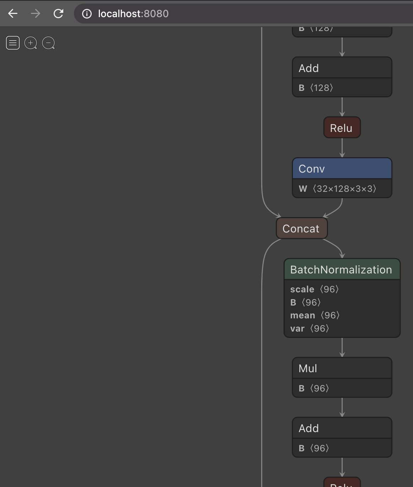

# Netron UBI Container Image

A Netron container image (Red Hat UBI base) - for Machine Learning Visualization.
* This repo just builds the app into a container image and pushes that image here: https://quay.io/repository/jasonredhat/netron
* The this awesome app was created by [Lutz Roeder](https://www.lutzroeder.com/) and its source is available at: [lutzroeder/netron](https://github.com/lutzroeder/netron)

It looks like this:

Things to do from here:

* Pull the image using CLI: `podman pull quay.io/jasonredhat/netron`
* Run locally with CLI: `podman run -p 8080:8080 quay.io/jasonredhat/netron:latest`
* Run it on an OpenShift cluster: `oc new-app quay.io/jasonredhat/netron`
* Grab a model from the [ONNX Model Zoo](https://github.com/onnx/models) and view it
